# Diagram Architektury UI - Moduł Autentykacji

Poniższy diagram przedstawia architekturę stron Astro i komponentów React dla modułu logowania i rejestracji w aplikacji CashFlow Scenarios.

```mermaid
flowchart TD
    %% Definicje stylów
    classDef pageClass fill:#e1f5ff,stroke:#01579b,stroke-width:2px
    classDef componentClass fill:#f3e5f5,stroke:#4a148c,stroke-width:2px
    classDef apiClass fill:#fff3e0,stroke:#e65100,stroke-width:2px
    classDef backendClass fill:#e8f5e9,stroke:#1b5e20,stroke-width:2px
    classDef layoutClass fill:#fce4ec,stroke:#880e4f,stroke-width:2px
    classDef uiClass fill:#f1f8e9,stroke:#33691e,stroke-width:1px
    
    %% Główny Layout
    subgraph Layout ["Layout (src/layouts/)"]
        direction TB
        LayoutAstro["Layout.astro<br/>Główny layout aplikacji"]:::layoutClass
        HeaderComp["Header.astro<br/>Nawigacja i status użytkownika"]:::layoutClass
        
        LayoutAstro --> HeaderComp
    end
    
    %% Strony publiczne (auth)
    subgraph AuthPages ["Strony Autentykacji (src/pages/auth/)"]
        direction TB
        LoginPage["login.astro<br/>Formularz logowania"]:::pageClass
        RegisterPage["register.astro<br/>Formularz rejestracji"]:::pageClass
        ForgotPasswordPage["forgot-password.astro<br/>Reset hasła"]:::pageClass
        UpdatePasswordPage["update-password.astro<br/>Nowe hasło"]:::pageClass
        CallbackPage["callback.astro<br/>Callback OAuth/Email"]:::pageClass
    end
    
    %% Strony aplikacji
    subgraph AppPages ["Strony Aplikacji (src/pages/)"]
        direction TB
        IndexPage["index.astro<br/>Strona główna<br/>Demo lub przekierowanie"]:::pageClass
        ScenarioPage["scenarios/[scenarioId].astro<br/>Widok scenariusza<br/>Wymaga autoryzacji"]:::pageClass
    end
    
    %% Komponenty autentykacji
    subgraph AuthComponents ["Komponenty Auth (src/components/auth/)"]
        direction TB
        AuthForm["AuthForm.tsx (React)<br/>Uniwersalny formularz<br/>Tryby: login, register,<br/>forgot-password, update-password"]:::componentClass
        DemoBanner["DemoBanner.astro<br/>Banner informacyjny<br/>Przycisk Reset demo"]:::componentClass
    end
    
    %% Komponenty aplikacji
    subgraph AppComponents ["Komponenty Aplikacji"]
        direction TB
        ScenarioView["ScenarioView.tsx (React)<br/>Widok scenariusza<br/>Tryb: normal lub demo"]:::componentClass
        
        subgraph UIComponents ["Shadcn/ui Components"]
            direction LR
            Button["Button"]:::uiClass
            Input["Input"]:::uiClass
            Label["Label"]:::uiClass
            Dialog["Dialog"]:::uiClass
        end
    end
    
    %% API Endpoints
    subgraph APIEndpoints ["API Endpoints (src/pages/api/auth/)"]
        direction TB
        LoginAPI["login.ts<br/>POST - Logowanie użytkownika"]:::apiClass
        RegisterAPI["register.ts<br/>POST - Rejestracja użytkownika"]:::apiClass
        LogoutAPI["logout.ts<br/>POST - Wylogowanie"]:::apiClass
        ForgotPasswordAPI["forgot-password.ts<br/>POST - Wysłanie linku reset"]:::apiClass
        UpdatePasswordAPI["update-password.ts<br/>POST - Zmiana hasła"]:::apiClass
    end
    
    %% Backend
    subgraph Backend ["Backend & Middleware"]
        direction TB
        Middleware["middleware/index.ts<br/>Zarządzanie sesją (cookies)<br/>createSupabaseServerClient<br/>Astro.locals.supabase"]:::backendClass
        SupabaseClient["db/supabase.client.ts<br/>Klient Supabase"]:::backendClass
        SupabaseAuth["Supabase Auth<br/>Zarządzanie użytkownikami<br/>Sesje i tokeny"]:::backendClass
        Database["PostgreSQL<br/>Tabele: user_profiles,<br/>companies, company_members<br/>Trigger: handle_new_user"]:::backendClass
    end
    
    %% Relacje między stronami a layoutem
    LayoutAstro -.-> LoginPage
    LayoutAstro -.-> RegisterPage
    LayoutAstro -.-> ForgotPasswordPage
    LayoutAstro -.-> UpdatePasswordPage
    LayoutAstro -.-> IndexPage
    LayoutAstro -.-> ScenarioPage
    
    %% Header - decyzje na podstawie sesji
    HeaderComp -->|"Sprawdza Astro.locals.session"| Middleware
    HeaderComp -->|"Jeśli niezalogowany"| DemoBanner
    
    %% Strony auth używają AuthForm
    LoginPage -->|"Renderuje"| AuthForm
    RegisterPage -->|"Renderuje"| AuthForm
    ForgotPasswordPage -->|"Renderuje"| AuthForm
    UpdatePasswordPage -->|"Renderuje"| AuthForm
    
    %% AuthForm używa komponentów UI
    AuthForm --> Button
    AuthForm --> Input
    AuthForm --> Label
    
    %% AuthForm wywołuje API
    AuthForm -->|"POST - email, password"| LoginAPI
    AuthForm -->|"POST - email, password, companyName"| RegisterAPI
    AuthForm -->|"POST - email"| ForgotPasswordAPI
    AuthForm -->|"POST - password"| UpdatePasswordAPI
    
    %% Strona główna - logika SSR
    IndexPage -->|"Sprawdza session w Astro.locals"| Middleware
    IndexPage -->|"Jeśli zalogowany: redirect"| ScenarioPage
    IndexPage -->|"Jeśli niezalogowany: renderuje demo"| ScenarioView
    IndexPage -->|"Wyświetla dla niezalogowanych"| DemoBanner
    
    %% Strona scenariusza
    ScenarioPage -->|"Weryfikuje autoryzację"| Middleware
    ScenarioPage -->|"Renderuje po weryfikacji"| ScenarioView
    
    %% ScenarioView używa UI
    ScenarioView --> Dialog
    ScenarioView --> Button
    
    %% API Endpoints komunikują się z Supabase
    LoginAPI -->|"supabase.auth.signInWithPassword()"| SupabaseAuth
    RegisterAPI -->|"supabase.auth.signUp()"| SupabaseAuth
    LogoutAPI -->|"supabase.auth.signOut()"| SupabaseAuth
    ForgotPasswordAPI -->|"supabase.auth.resetPasswordForEmail()"| SupabaseAuth
    UpdatePasswordAPI -->|"supabase.auth.updateUser()"| SupabaseAuth
    
    %% Middleware tworzy klienta Supabase
    Middleware -->|"Używa @supabase/ssr"| SupabaseClient
    
    %% API używa klienta z Astro.locals
    LoginAPI -.->|"Pobiera z Astro.locals"| Middleware
    RegisterAPI -.->|"Pobiera z Astro.locals"| Middleware
    LogoutAPI -.->|"Pobiera z Astro.locals"| Middleware
    
    %% Supabase Auth i Database
    SupabaseAuth <-->|"Zarządza użytkownikami"| Database
    RegisterAPI -->|"Wywołuje trigger handle_new_user"| Database
    
    %% Callback obsługuje OAuth i email verification
    CallbackPage -->|"Obsługuje redirect z Supabase"| SupabaseAuth
    
    %% Wylogowanie
    HeaderComp -->|"Przycisk Wyloguj"| LogoutAPI
    
    %% Nawigacja z Header
    HeaderComp -->|"Przycisk Zaloguj się"| LoginPage
    HeaderComp -->|"Przycisk Zarejestruj się"| RegisterPage
    DemoBanner -->|"Link do logowania"| LoginPage
    DemoBanner -->|"Link do rejestracji"| RegisterPage
```



## Legenda

- **Niebieski** - Strony Astro (server-side rendering)
- **Fioletowy** - Komponenty React i Astro
- **Pomarańczowy** - API Endpoints
- **Zielony** - Backend i Middleware
- **Różowy** - Layout
- **Jasnozielony** - Komponenty UI (Shadcn/ui)

## Kluczowe przepływy

### 1. Rejestracja nowego użytkownika
```
RegisterPage → AuthForm (mode: register) → RegisterAPI → Supabase Auth → 
Database Trigger (handle_new_user) → Utworzenie profilu i firmy
```

### 2. Logowanie użytkownika
```
LoginPage → AuthForm (mode: login) → LoginAPI → Supabase Auth → 
Ustawienie cookie sesji → Przekierowanie do IndexPage
```

### 3. Tryb demo (niezalogowany użytkownik)
```
IndexPage → Sprawdzenie sesji (brak) → Renderowanie ScenarioView (mode: demo) + 
DemoBanner → localStorage dla zmian
```

### 4. Autoryzacja do scenariusza
```
ScenarioPage → Middleware (weryfikacja sesji) → Sprawdzenie company_members → 
Renderowanie ScenarioView lub 401 Unauthorized
```

### 5. Reset hasła
```
ForgotPasswordPage → AuthForm (mode: forgot-password) → ForgotPasswordAPI → 
Supabase Auth (wysyła email) → UpdatePasswordPage → UpdatePasswordAPI
```

## Zarządzanie sesją

Middleware (`middleware/index.ts`) jest kluczowym elementem:
- Używa `@supabase/ssr` do zarządzania sesjami przez HTTP-only cookies
- Tworzy klienta Supabase dostępnego w `Astro.locals.supabase`
- Odświeża sesję przy każdym żądaniu
- Wszystkie strony i API endpoints mają dostęp do sesji przez `Astro.locals`

## Row Level Security (RLS)

- Polityki RLS oparte na `auth.uid()` w PostgreSQL
- Użytkownik ma dostęp tylko do danych firm, do których należy (tabela `company_members`)
- Weryfikacja automatyczna na poziomie bazy danych
